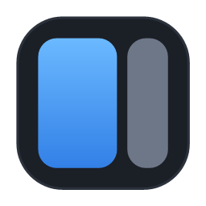
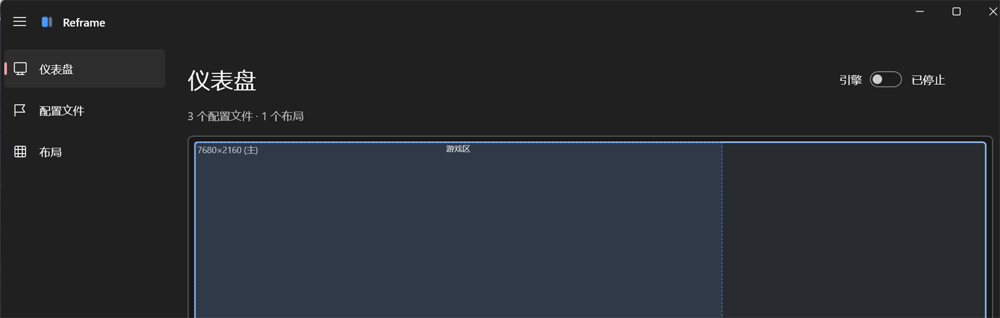

<div align="center">



<h1>Reframe</h1>

<p><b>无边框窗口管理器,布局随显示器自适应。</b></p>

<p>
  <a href="LICENSE"></a>
  
  
  
  <a href="https://github.com/shuiandy/Reframe/releases"></a>
</p>

<p><a href="README.md">English</a> · <b>简体中文</b></p>



</div>

Reframe 把窗口的标题栏和边框去掉,再按你定义的位置摆好——但这个位置是一份**命名布局**,以比例存储,运行时按窗口当前所在的显示器解析。把同一个游戏从 57 寸带鱼屏挪到串流出来的虚拟显示器,它会自动重新适配,无需手改。

## 为什么是 Reframe

多数无边框工具把每个游戏的位置写成一个固定像素值。Reframe 的思路不同——**布局是一等公民,位置是相对的**:

- **布局可复用。** 一份*布局*是一组命名分区,profile 只引用 `布局 + 分区`。改一处布局,所有引用它的游戏跟着变,不用逐个游戏返工。
- **分区与分辨率无关。** 分区以 `0~1` 比例存储,按窗口当前所在的显示器解析。7680 宽屏的 ⅔ 是 5120 像素;把窗口挪到更小的屏——或串流出来的虚拟屏——它会自动重算,无需手改。
- **按显示器分支。** 每个 profile 持有一张有序规则表,*自上而下第一条命中的显示器生效*:`7680×2160 → 套游戏区`、`其它任意屏 → 铺满`。同一个游戏在本机桌面和串流时可以有不同行为。
- **实时,不靠重启。** UI 改动立即生效,外部手改 `config.json` 也会被监听并热重载。
- **事件驱动。** WinEvent 钩子在窗口出现、自己改名、或被游戏改回的那一刻就响应,配一条低频兜底轮询。
- **始终可逆。** 改动前快照窗口的原始样式与位置,禁用 profile 或停止引擎时自动还原。

## 功能

#### 🪟 窗口与配置
- **窗口面板**(双栏):左栏实时列出运行中的窗口——带图标、搜索、「显示已过滤」开关——右栏是配置列表。一键从任意窗口建配置。
- **忽略名单**:右键窗口「忽略此进程」(可逆,按用户保存);系统/外壳窗口自动过滤掉。

#### 🧩 布局与吸附
- **FancyZones 式布局编辑器**:画布上分区,带预设模板(左右二等分、三等分、左⅔+右⅓、16:9 居中、21:9 居左),像素与比例双显。
- **拖拽吸附**:按住 Shift 拖任意窗口——分区高亮,松手入位。
- **截图式选区**:在全屏遮罩上拖出矩形,带边缘/比例吸附。

#### 🎮 一键启动
- **启动命令 + Unity 分辨率预设**:配置可填启动命令(启动器 URI 如 `hoyoplay://`,或可执行文件路径)。对渲染分辨率钉死在注册表的 Unity 游戏,Reframe 启动前先写分辨率预设,再只定位窗口、不缩放。
- **图标系统**,带可选的 [SteamGridDB](https://www.steamgriddb.com/) 兜底——给本地读不到图标的游戏(反作弊保护的进程)联网取图。

#### ⚙️ 系统集成
- **可配置全局热键**:对前台窗口切换无边框,或送入布局分区 1/2/3。全部可改绑。
- **托盘常驻、单实例、可选开机自启**(经计划任务,以管理员身份启动且不弹 UAC)。
- **Mica / Mica Alt / 亚克力**背景材质,以及跟随系统 / 浅色 / 深色主题三选。
- **配置导入 / 导出**(导入前校验),崩溃日志落在 `%LOCALAPPDATA%\Reframe\crash.log`。

## 安装

1. 从 [Releases](https://github.com/shuiandy/Reframe/releases) 下载最新的 `Reframe-v<版本>-win-x64.zip`。
2. 解压到任意位置,运行 `Reframe.exe`。

**环境要求**

- **Windows 10 1809+ / Windows 11**,x64。
- **[.NET 9 桌面运行时](https://dotnet.microsoft.com/download/dotnet/9.0)**——发布包对 .NET 是框架依赖的。Windows App SDK 已自包含,无需单独安装。
- **管理员权限**——Reframe 经清单自提权。

<details>
<summary><b>为什么要管理员?</b></summary>

<br>

反作弊游戏的窗口运行在提权/受保护的完整性级别下。Windows 的 [UIPI](https://learn.microsoft.com/zh-cn/windows/win32/winmsg/about-messages-and-message-queues) 不允许低完整性进程操作高完整性窗口,所以 Reframe 必须提权才能重新摆放这些窗口。

把这份提权用在哪,说明白:**Reframe 不注入代码,不读写游戏内存。** 它只调用标准 Win32 窗口 API——用 `SetWindowLongPtr` 砍掉标题栏/边框样式,用 `SetWindowPos` 移动和调整窗口尺寸。仅此而已。(详见 [FAQ](#faq)。)

</details>

## 快速上手

1. **建配置**——打开「配置文件」页,在左栏找到你的游戏(先跑一次让它出现在列表里),点一下建配置。或用「新建」手填进程名。
2. **画布局**——在「布局」页选个预设,或在画布上自己分区,存为命名布局。
3. **接管**——在配置里加一条规则:选显示器(按分辨率,或「任意」),指向某布局的某分区(或铺满)。第一条命中窗口当前所在显示器的规则生效。确认引擎已开(在「仪表盘」切换)。

**默认热键**

| 动作 | 默认 |
|---|---|
| 切换前台窗口的无边框 | `Ctrl + Alt + B` |
| 送前台窗口入分区 1 / 2 / 3 | `Ctrl + Alt + 1` / `2` / `3` |

所有热键可在「设置」页改绑。分区热键用的是你第一个布局的分区,按前台窗口当前所在显示器解析。

## 从源码构建

需要 **.NET 9 SDK** 与 Windows App SDK 工作负载。

```powershell
# 调试构建
dotnet build -p:Platform=x64

# 跑测试(独立工程,链接 Core 源文件)
dotnet test Tests\Reframe.Core.Tests.csproj

# 打包 Release zip -> dist\Reframe-v<版本>-win-x64.zip
powershell -ExecutionPolicy Bypass -File tools\publish.ps1
```

`publish.ps1` 产出的包对 **.NET 是框架依赖的**(目标机需 .NET 9 桌面运行时),但 **Windows App SDK 已自包含**(目标机无需另装)。它发布到独立的 `publish_out\` 目录,不影响 `bin\Debug` 与正在运行的实例。

## 架构

Reframe 分成零 UI 依赖的 **Core** 与其上的 WinUI 3 外壳:

- **`Core/`**——引擎。检测(`WinEventHook` + 兜底轮询)、匹配(进程名 / 标题 / 正则)、解析(`PlacementResolver`,纯函数:显示器矩形 → 规则 → 像素矩形,完整单测覆盖)、应用(`WindowOps`:样式/位置改动,带快照还原),还有一条防抖策略避免引擎跟一个不停自己挪窗口的游戏拉锯。零 UI 依赖,所以摆放数学可以隔离单测。
- **`Services/`**——配置(`System.Text.Json` 源生成,热重载)、显示器、热键、托盘、图标缓存、游戏启动、开机自启。
- **`UI/`**——WinUI 3 页面(仪表盘、配置文件、布局、设置)与自绘画布控件。手写 `INotifyPropertyChanged`,无 MVVM 框架。

完整设计——数据模型、引擎管线、各功能实现状态——见 [DESIGN.md](DESIGN.md)。

## 配置文件

```
%LOCALAPPDATA%\Reframe\config.json
```

首次运行若不存在则落盘。JSON 经 `System.Text.Json` 源生成读写,带 `Version` 字段备日后迁移。可直接手改——程序会监听并热重载(原子写入 + 半截文件容错,写到一半的文件不会冲掉运行中的配置)。「设置」页也有导入 / 导出。

## FAQ

**用在反作弊游戏上安全吗?**
Reframe 只通过有文档的 Win32 API(`SetWindowLongPtr`、`SetWindowPos`)改窗口的**样式**与**位置**。它从不注入代码、从不读写其它进程的内存、从不碰游戏文件。但话说回来,没有任何第三方工具能担保某个反作弊会作何反应——请自行判断。

**为什么是 unpackaged(不是商店的 MSIX)?**
应用需要 `requireAdministrator` 清单才能操作提权的游戏窗口(见[为什么要管理员?](#为什么要管理员))。MSIX 打包与 `requireAdministrator` 冲突,所以 Reframe 以普通 unpackaged 可执行文件分发。

**已知限制**
- 独占全屏的游戏没有可操作的带边框窗口——请以窗口 / 无边框模式启动。(默认配置里的米哈游三件套本就是 borderless/windowed。)
- UWP 与受保护进程的窗口动不了;Reframe 会报「无权限」而非静默失败。
- 部分高级选项暂未实现(保持客户区、跨所有屏、隐藏任务栏、移除菜单等),详见 [DESIGN.md](DESIGN.md) §4 状态列。

## 参与贡献

欢迎提 issue 和 PR——bug 反馈、功能点子、使用疑问,都有帮助。

**尤其欢迎翻译。** UI 已通过 `.resw` 资源完整本地化(目前支持英文和简体中文)。新增一门语言基本就是翻译一个资源文件夹——步骤见 [docs/dev/I18N.md](docs/dev/I18N.md)。想帮忙的话,开个 issue。

提 PR 时,请让 **Core** 层保持零 UI 依赖(摆放数学住在那儿,有单测覆盖),并在推送前跑一遍 `dotnet test Tests\Reframe.Core.Tests.csproj`。

## 致谢

- [**PowerToys FancyZones**](https://github.com/microsoft/PowerToys) —— 分区式布局编辑器与拖拽吸附交互的灵感来源。

## 许可证

[MIT](LICENSE) © 2026 shuiandy
